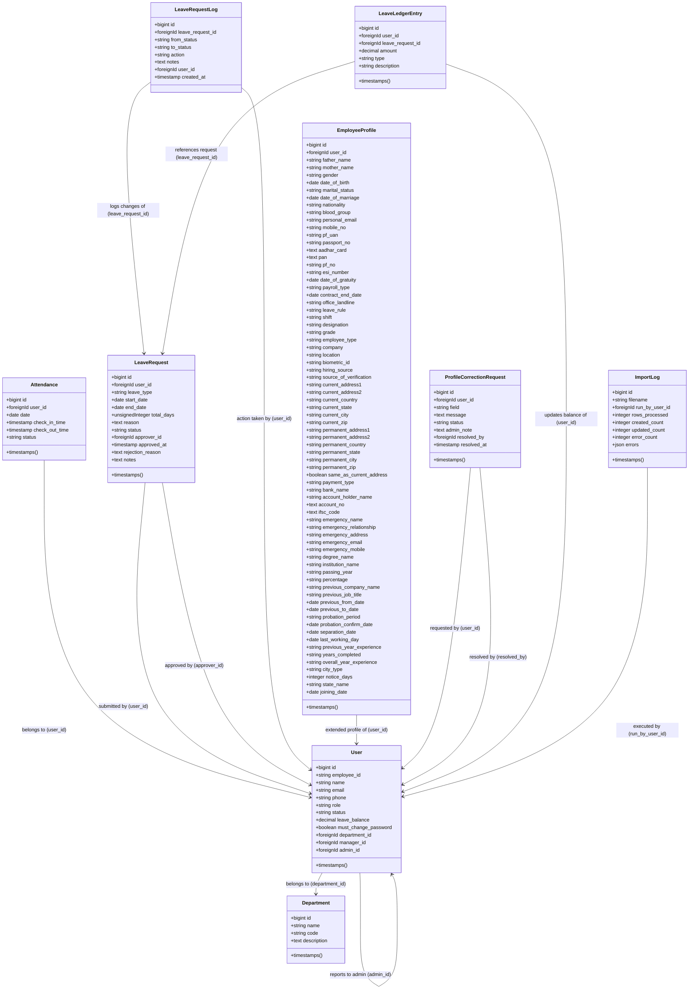

# AMS-V1 — Project Chronicle

A comprehensive, production-ready system blueprint and chronological history of the Attendance Management System Version 1 (AMS-V1). This document functions as an exhaustive reference for future developers, maintainers, auditors, project managers, investors, clients, and AI systems.

---

## 1. Executive Summary

### What AMS-V1 Is
AMS-V1 (Attendance Management System Version 1) is a full-stack, enterprise-grade Human Resource (HR) and Workforce Punctuality tracking platform. The application is built on top of Laravel 12 and PHP 8.2+, featuring a premium dark-gold glassmorphic UI. It operates as a secure repository for employee metadata, daily clock-in/out records, and leave balance accounts.

### Why It Was Built
Before the development of AMS-V1, the organization faced significant operational vulnerabilities:
* **Spreadsheet Chaos:** Attendance logs were distributed across scattered sheets, causing duplicate entries, inconsistencies, and manual calculation errors.
* **Manual Email Leaves:** Leave requests were submitted via email and chat, resulting in unrecorded absences, missing audit histories, and lack of transparency.
* **Security & Data Exposure:** Sensitive data (such as bank details, IFSC codes, PAN, and Aadhaar numbers) was stored in raw text in unsecured spreadsheets, exposing the company to privacy liabilities.
* **Inefficient Migration:** Migrating staff data from third-party platforms (like Zimyo) was slow and prone to errors.

AMS-V1 was developed to own the workforce data, eliminate spreadsheet chaos, and build a unified, secure portal for workforce operations.

### Primary Business Goals
1. **Punctuality Governance:** Systematically track clock-in and clock-out timestamps, enforcing shift start times and grace periods while calculating late arrivals.
2. **Leave Balance Integrity:** Maintain accurate, transactional, and audit-logged leave balances using double-entry ledger principles.
3. **Data Security & Privacy:** Encrypt sensitive financial and government identification data at rest.
4. **Zimyo Migration Compatibility:** Allow seamless bulk import of existing employee databases from standard Zimyo system exports.

### Target Users
* **Administrators:** HR managers and system operators who have full access to employee directories, department creation, system imports, attendance audit logs, correction requests, and leave overrides.
* **Managers:** Department heads who supervise assigned employee rosters, monitor live attendance logs, and approve/reject leave requests.
* **Employees:** General workforce members who clock in/out daily, request profile corrections, request leaves, and review their historical logs and stats.

### Current Production Status
* **Hosting Environment:** Active in production on a Linux Shared Hosting server (Hostinger) via cPanel, utilizing SQLite locally and MySQL 8.0 in production.
* **Version:** `v1.2-phase-4.6`
* **Codebase Health:** 98 tests, 534 assertions (100% passing).

---

## 2. Technology Stack

AMS-V1 is built using modern web development standards and optimized for deployment in resource-constrained shared hosting environments:

* **Framework:** Laravel 12.0 (with Eloquent ORM, Blade templating, and console tools).
* **Programming Language:** PHP 8.2+ (fully compatible with PHP 8.1+ null-safety patterns).
* **Database Engine:**
  * **Production:** MySQL 8.0 (utilizing transactional row locks and indexing for scale).
  * **Testing/Local:** SQLite (in-memory for maximum test runner speed).
* **Authentication & Authorization:** Laravel Breeze (Blade-based) fortified with custom middleware for role permissions and mandatory password resets.
* **Frontend Architecture:** HTML5 Semantic Markup + Vanilla Javascript (for reactive UI behaviors, active timezone tickers, and animations).
* **Styling & Design System:** Tailwind CSS v4.0 (utilizing `@postcss` compilation) augmented with custom CSS variables, glassmorphic panels, and hover transformations in [app.css](file:///c:/Users/Lenovo/AMS-V1/resources/css/app.css).
* **Deployment & Hosting:** Hostinger Linux Shared Hosting via cPanel, deploying with Composer package management, Vite compiled asset compilation, and symlinked storage configurations.
* **Git Workflow:** 
  * Main branch `main` acts as the source of truth for deployment.
  * Tagging standard: Release tags matching `v[Major].[Minor]-phase-[PhaseNum]` (e.g. `v1.2-phase-4.6`).

---

## 3. System Architecture

The AMS-V1 codebase is structured as a clean MVC application, utilizing specialized Service layers to encapsulate domain logic:



### Major Application Modules

#### 1. Authentication & RBAC
* **Authentication:** Handled through Laravel Breeze session authentication.
* **Role-Based Access Control (RBAC):** Handled via user attributes. The roles are:
  * `admin`: Has global access.
  * `manager`: Access limited to assigned employees.
  * `employee`: Restricted to self-service portals.
* **Hierarchy Verification:** Controller routes are scoped using Eloquent queries (e.g. `$employees = User::where('manager_id', auth()->id())->get()`) to ensure managers cannot view or edit employees belonging to other departments.

#### 2. Workforce Management & Employee Profiles
* Managed via [EmployeeController](file:///c:/Users/Lenovo/AMS-V1/app/Http/Controllers/EmployeeController.php).
* Employee credentials, joining dates, roles, and status are stored in `users`.
* Personal and sensitive data is stored in the 1:1 mapped table `employee_profiles`.
* Sensitive identification elements (Aadhaar, PAN, Bank Account Number, IFSC Code) are cast as `encrypted` at the Eloquent model layer in [EmployeeProfile.php](file:///c:/Users/Lenovo/AMS-V1/app/Models/EmployeeProfile.php).

#### 3. Attendance Tracking & Auditing
* **Attendance Engine:** Encapsulated in [AttendanceService.php](file:///c:/Users/Lenovo/AMS-V1/app/Services/AttendanceService.php). Calculates whether a user's clock-in time is within grace periods and determines delay minutes.
* **Attendance Audit Center:** Built under [AttendanceAuditController.php](file:///c:/Users/Lenovo/AMS-V1/app/Http/Controllers/AttendanceAuditController.php), providing HR admins with a queryable ledger of daily records, filters (by status, date, department, name), exception metrics (late arrivals list, average delay), and status updates.

#### 4. Leave Management & Balance Ledger
* **Leave Requests:** Handled by [LeaveRequestController](file:///c:/Users/Lenovo/AMS-V1/app/Http/Controllers/LeaveRequestController.php). Standard employees submit requests without classifying them (saved as `leave_type = null`, `status = pending`).
* **Classification Workflow:** Managers/Admins review pending requests and approve them as either **Paid Leave** (which decreases the user's `leave_balance` and records a ledger entry) or **Unpaid Leave** (which doesn't affect the balance).
* **Audit Trail Ledger:** Governed by `LeaveLedgerEntry` logs, which record modifications under types: `opening_balance`, `accrual`, `deduction`, `refund`, and `adjustment`.
* **Concurrency Protections:** Employs MySQL pessimistic locks (`lockForUpdate()`) and transactions (`DB::transaction()`) during approvals and overrides.

#### 5. Employee Import System
* Built under [EmployeeImportService.php](file:///c:/Users/Lenovo/AMS-V1/app/Services/EmployeeImportService.php) and managed by [ImportController](file:///c:/Users/Lenovo/AMS-V1/app/Http/Controllers/ImportController.php).
* Parses Zimyo Excel spreadsheets, auto-creates missing departments, maps hierarchical manager chains in two passes, auto-assigns temporary passwords, registers opening leave balances, and logs error outputs to the `import_logs` table.

#### 6. Profile Correction Requests
* Built under [ProfileCorrectionRequestController.php](file:///c:/Users/Lenovo/AMS-V1/app/Http/Controllers/ProfileCorrectionRequestController.php).
* Employees submit requests pointing to a specific field.
* Admins review a list of requests and mark them as resolved. A live count badge in the sidebar navigation displays pending requests for Admins.

#### 7. Scheduled Tasks
* Controlled via custom console commands in `app/Console/Commands`:
  * `leaves:initialize-balances`: Credits 2 opening leaves for active workforce members.
  * `leaves:accrue`: Credits 2 leaves on the first of each month to all active employees and managers (idempotency checked by tracking ledger items in the current calendar month).

---

## 4. Complete Phase History

The evolution of the AMS-V1 project is structured into sequential development phases:

### Phase B — Stitch Sidebar Redesign
* **Business Problem:** Navigation was scattered across the top header in Breeze templates, creating a cluttered UI that did not adapt to mobile viewports.
* **Features Implemented:** Integrated a responsive, glassmorphic left sidebar menu (`components/sidebar.blade.php`) containing dynamic link options based on role checks.
* **Files Introduced/Modified:**
  * [sidebar.blade.php](file:///c:/Users/Lenovo/AMS-V1/resources/views/components/sidebar.blade.php) [NEW]
  * [app.blade.php](file:///c:/Users/Lenovo/AMS-V1/resources/views/layouts/app.blade.php) [MODIFY]
* **Architectural Decisions:** Established a layout structure with a sticky sidebar and scrolling main workspace panel.
* **Database Changes:** None.
* **Testing Performed:** UI verification across desktop and mobile screens.

### Phase C — Attendance Tracking Foundation
* **Business Problem:** The organization could not log clock-in/out times or identify employees arriving late.
* **Features Implemented:** Database schema for logging check-ins, checking in/out controller endpoints, late checking validation (relative to a 09:00 AM start time with a 15-minute grace threshold), and historical user logs view.
* **Files Introduced/Modified:**
  * `database/migrations/2026_06_10_000000_create_attendances_table.php` [NEW]
  * [Attendance.php](file:///c:/Users/Lenovo/AMS-V1/app/Models/Attendance.php) [NEW]
  * [AttendanceService.php](file:///c:/Users/Lenovo/AMS-V1/app/Services/AttendanceService.php) [NEW]
  * [AttendanceController.php](file:///c:/Users/Lenovo/AMS-V1/app/Http/Controllers/AttendanceController.php) [NEW]
  * `resources/views/attendance/my-attendance.blade.php` [NEW]
* **Architectural Decisions:** Separated core logic from routing controllers by building `AttendanceService.php`. Added a unique key on `[user_id, date]` to prevent duplicate clock-in records.
* **Database Changes:** Created the `attendances` table with columns: `user_id`, `date`, `check_in_time`, `check_out_time`, and `status` (`present`, `absent`, `late`).
* **Testing Performed:** Feature tests for clock-in and clock-out operations, confirming status transition to `late` if checking in after 09:15 AM.

### Phase C.1 — Employee and Department CRUD
* **Business Problem:** Administrators could not manage organizational departments or update staff profiles.
* **Features Implemented:** Department CRUD forms, Employee directory control tables, status toggles (`active`/`inactive`), and auto-generated unique employee IDs.
* **Files Introduced/Modified:**
  * [DepartmentController.php](file:///c:/Users/Lenovo/AMS-V1/app/Http/Controllers/DepartmentController.php) [NEW]
  * [EmployeeController.php](file:///c:/Users/Lenovo/AMS-V1/app/Http/Controllers/EmployeeController.php) [NEW]
  * Views folders `resources/views/employees/` and `resources/views/departments/` [NEW]
* **Database Changes:** Created `departments` table (via `2026_06_09_142514_create_departments_table.php`).
* **Testing Performed:** Validation tests checking department name requirements and employee duplicate ID prevention.

### Phase D — Hierarchy & Workforce Management
* **Business Problem:** Managers could view staff lists of unrelated departments, posing data privacy risks.
* **Features Implemented:** Structured manager mappings using a self-referencing hierarchy, restricting manager access to direct reports.
* **Files Introduced/Modified:**
  * `database/migrations/2026_06_11_134500_add_admin_id_to_users_table.php` [NEW]
  * [DashboardController.php](file:///c:/Users/Lenovo/AMS-V1/app/Http/Controllers/DashboardController.php) [NEW]
* **Architectural Decisions:** Scoped employee lists in manager views to only return records where `manager_id = auth()->id()`.
* **Database Changes:** Modified the `users` table to add `manager_id`, `admin_id`, and `department_id` keys.
* **Testing Performed:** Created `HierarchySplitTest.php` to verify database partitioning between manager profiles.

### Phase E — Leave Requests & Rule B Override
* **Business Problem:** Employees on approved leaves were flagged as "Absent" because they lacked daily check-in logs.
* **Features Implemented:** Leave requests submission, approval/rejection endpoints, and Rule B: `AttendanceService` checks for approved leave requests on historical runs to assign `on_leave` or `wfh` statuses if check-in is empty.
* **Files Introduced/Modified:**
  * `database/migrations/2026_06_11_153000_create_leave_requests_table.php` [NEW]
  * `database/migrations/2026_06_11_153500_create_leave_request_logs_table.php` [NEW]
  * [LeaveRequest.php](file:///c:/Users/Lenovo/AMS-V1/app/Models/LeaveRequest.php) [NEW]
  * [LeaveRequestLog.php](file:///c:/Users/Lenovo/AMS-V1/app/Models/LeaveRequestLog.php) [NEW]
  * [LeaveRequestController.php](file:///c:/Users/Lenovo/AMS-V1/app/Http/Controllers/LeaveRequestController.php) [NEW]
* **Database Changes:** Created `leave_requests` and `leave_request_logs` tables.
* **Testing Performed:** Verified that physical clock-ins override active leave request statuses for the day.

### Phase 4 — Profiles & Encrypted Fields
* **Business Problem:** Storing sensitive credentials (Aadhaar, PAN, Bank Details) in raw text was a security risk.
* **Features Implemented:** Expanded employee profiles tab view and model-level field encryption.
* **Files Introduced/Modified:**
  * `database/migrations/2026_06_18_093324_create_employee_profiles_table.php` [NEW]
  * [EmployeeProfile.php](file:///c:/Users/Lenovo/AMS-V1/app/Models/EmployeeProfile.php) [NEW]
* **Architectural Decisions:** Utilized Laravel's model-level encryption casts, decrypting fields automatically on read and encrypting them on save.
* **Database Changes:** Created `employee_profiles` table.
* **Testing Performed:** Confirmed that fields are stored as encrypted text strings in the database but read as raw text in the application.

### Phase 4.1 — Zimyo Migration Engine
* **Business Problem:** Migrating employee databases from Zimyo export sheets manually was slow and error-prone.
* **Features Implemented:** Bulk Excel importing engine via `PhpSpreadsheet` library with error reporting.
* **Files Introduced/Modified:**
  * `database/migrations/2026_06_18_193234_create_import_logs_table.php` [NEW]
  * [EmployeeImportService.php](file:///c:/Users/Lenovo/AMS-V1/app/Services/EmployeeImportService.php) [NEW]
  * [ImportController.php](file:///c:/Users/Lenovo/AMS-V1/app/Http/Controllers/ImportController.php) [NEW]
* **Architectural Decisions:** Implemented a two-pass import to resolve manager-employee relationships.
* **Database Changes:** Created `import_logs` table.
* **Testing Performed:** Created `ImportEmployeesTest.php` to validate file parsing and error handling.

### Phase 4.2 — Correction Requests & Hardening
* **Business Problem:** Employees needed a way to update errors in their profile details without direct edit access.
* **Features Implemented:** Correction request forms, an admin review queue, and transaction processing.
* **Files Introduced/Modified:**
  * `database/migrations/2026_06_19_090000_create_profile_correction_requests_table.php` [NEW]
  * [ProfileCorrectionRequest.php](file:///c:/Users/Lenovo/AMS-V1/app/Models/ProfileCorrectionRequest.php) [NEW]
  * [ProfileCorrectionRequestController.php](file:///c:/Users/Lenovo/AMS-V1/app/Http/Controllers/ProfileCorrectionRequestController.php) [NEW]
* **Database Changes:** Created `profile_correction_requests` table.
* **Testing Performed:** Verified state updates and error rollbacks under database transactions.

### Phase 4.3 — Experience Column Corrections
* **Business Problem:** The experience columns in `employee_profiles` were originally decimal fields, which caused import failures when parsing strings like `"5 Years 2 Months"`.
* **Features Implemented:** Changed experience columns to string fields.
* **Files Introduced/Modified:**
  * `database/migrations/2026_06_19_084725_change_experience_columns_to_strings_in_employee_profiles.php` [NEW]
* **Database Changes:** Converted `previous_year_experience`, `years_completed`, and `overall_year_experience` to nullable string columns.
* **Testing Performed:** Checked that alphanumeric experience records import successfully.

### Phase 4.4 — Punctuality Audit Center
* **Business Problem:** Administrators lacked a unified interface to audit check-in histories, filter metrics, and analyze delay averages.
* **Features Implemented:** A scrollable audit grid, search filters, late arrival metrics, exception reporting, and a dark-gold glassmorphic UI.
* **Files Introduced/Modified:**
  * [AttendanceAuditController.php](file:///c:/Users/Lenovo/AMS-V1/app/Http/Controllers/AttendanceAuditController.php) [NEW]
  * `resources/views/admin/attendance-logs.blade.php` [NEW]
* **Database Changes:** None.
* **Testing Performed:** Validated query results across different combinations of date, status, and department filters.

### Phase 4.5 — Leave Balance Ledger & Concurrency
* **Business Problem:** User leave balances were edited directly without change logs, which created risk for database race conditions.
* **Features Implemented:** Integrated the `LeaveLedgerEntry` transaction log table, pessimistic row locking (`lockForUpdate`), and artisan commands for monthly accruals.
* **Files Introduced/Modified:**
  * `database/migrations/2026_06_23_000000_add_leave_balance_and_ledger_tables.php` [NEW]
  * [LeaveLedgerEntry.php](file:///c:/Users/Lenovo/AMS-V1/app/Models/LeaveLedgerEntry.php) [NEW]
  * [AccrueLeavesCommand.php](file:///c:/Users/Lenovo/AMS-V1/app/Console/Commands/AccrueLeavesCommand.php) [NEW]
  * [InitializeBalancesCommand.php](file:///c:/Users/Lenovo/AMS-V1/app/Console/Commands/InitializeBalancesCommand.php) [NEW]
* **Database Changes:** Added `leave_balance` to the `users` table. Created `leave_ledger_entries` table.
* **Testing Performed:** Created `LeaveBalanceTest.php` to simulate concurrent approvals and verify balance deductions.

### Phase 4.6 — Leave Workflow Simplification & Badge Alerts
* **Business Problem:** Standard employees self-classified leaves (e.g. casual, sick, WFH), which created review overhead. Admins also needed a clear sidebar indicator for pending correction requests.
* **Features Implemented:** Made `leave_type` nullable in submissions. Standard employees request leave with only dates and reasons. Approving managers choose **Approve as Paid** or **Approve as Unpaid**. Admin self-requests remain auto-approved but require choosing paid/unpaid on creation. Added a red notification badge in the sidebar for pending profile correction requests. Resolved PHP 8.1+ null-safety string replacement warnings in views.
* **Files Introduced/Modified:**
  * `database/migrations/2026_06_23_184204_make_leave_type_nullable_in_leave_requests_table.php` [NEW]
  * [LeaveRequestController.php](file:///c:/Users/Lenovo/AMS-V1/app/Http/Controllers/LeaveRequestController.php) [MODIFY]
  * [sidebar.blade.php](file:///c:/Users/Lenovo/AMS-V1/resources/views/components/sidebar.blade.php) [MODIFY]
  * `resources/views/leaves/index.blade.php`, `create.blade.php`, `show.blade.php` [MODIFY]
* **Database Changes:** Made the `leave_type` column nullable in the `leave_requests` table.
* **Testing Performed:** Updated the test suite, confirming 100% success across 98 tests and 534 assertions.

### Phase 4.7 — Architecture Traceability & Consolidation
* **Business Problem:** Early speed-oriented development led to fragmented documentation, unmapped database configurations, missing historical git tags, and lack of clear traceability for key architectural constraints.
* **Features Implemented:** Executed a comprehensive retrospective database, codebase, and security audit. Established Feature/Database/Test maps, registered historical tags, documented timezone locks and pessimistic locking strategies, and consolidated docs.
* **Files Introduced/Modified:**
  * [FEATURE_MAP.md](file:///c:/Users/Lenovo/AMS-V1/docs/FEATURE_MAP.md) [NEW]
  * [DATABASE_MAP.md](file:///c:/Users/Lenovo/AMS-V1/docs/DATABASE_MAP.md) [NEW]
  * [TEST_MAP.md](file:///c:/Users/Lenovo/AMS-V1/docs/TEST_MAP.md) [NEW]
  * [DECISION_LOG.md](file:///c:/Users/Lenovo/AMS-V1/docs/DECISION_LOG.md) [NEW]
  * [ARCHITECTURE_MAP.md](file:///c:/Users/Lenovo/AMS-V1/docs/ARCHITECTURE_MAP.md) [NEW]
* **Database Changes:** None.
* **Testing Performed:** Audit verification of all tests passing (98 tests, 534 assertions).

### Phase 4.7.2 — Leave Authorization System & Credits Engine
* **Business Problem:** Storing Paid/Unpaid selections on leave requests caused workflow friction and lacked automated controls for special credits (e.g. Birthday Leaves). Furthermore, the attendance system lacked a clear, approval-driven source of truth for daily payroll deductions.
* **Features Implemented:** Removed Paid/Unpaid select workflows, replacing them with Planned, Unplanned, and Birthday Leave categories. Setup an approval-driven attendance resolution system where approved leaves resolve to `on_leave` (protecting salary) and rejected/cancelled leaves default to `absent` (salary-deducted) unless overridden by check-in logs. Built a reusable `leave_credits` engine that automatically syncs and unlocks birthday leave credits 1 day before the birthday, auto-approves requests, handles leap year fallbacks, blocks DOB modifications when active credits exist, and expires unused credits 12 months after the birthday.
* **Files Introduced/Modified:**
  * `database/migrations/2026_06_24_154000_create_leave_credits_table.php` [NEW]
  * `database/migrations/2026_06_24_154400_add_leave_credit_id_to_leave_requests.php` [NEW]
  * [LeaveCredit.php](file:///c:/Users/Lenovo/AMS-V1/app/Models/LeaveCredit.php) [NEW]
  * [User.php](file:///c:/Users/Lenovo/AMS-V1/app/Models/User.php) [MODIFY]
  * [LeaveRequest.php](file:///c:/Users/Lenovo/AMS-V1/app/Models/LeaveRequest.php) [MODIFY]
  * [LeaveRequestController.php](file:///c:/Users/Lenovo/AMS-V1/app/Http/Controllers/LeaveRequestController.php) [MODIFY]
  * [AttendanceService.php](file:///c:/Users/Lenovo/AMS-V1/app/Services/AttendanceService.php) [MODIFY]
  * [LeaveAuthorizationModelTest.php](file:///c:/Users/Lenovo/AMS-V1/tests/Feature/LeaveAuthorizationModelTest.php) [NEW]
  * views `leaves/create.blade.php`, `index.blade.php`, `show.blade.php` [MODIFY]
* **Database Changes:** Created the `leave_credits` table (columns: `id`, `user_id`, `amount`, `used_amount`, `source_identifier`, `status`, `expires_at`, `granted_by`, `timestamps`). Added `leave_credit_id` (FK to `leave_credits.id`, nullable) to `leave_requests` table.
* **Testing Performed:** Created a full suite of feature tests in `LeaveAuthorizationModelTest.php` and updated legacy tests to remove Paid/Unpaid paths, ensuring 100% test coverage with 102 passing tests (546 assertions).

---

## 5. Database Evolution History

This section documents the chronological progression of the database schema migrations:

### 1. Initial Tables (Laravel Default)
* **Migrations:** `0001_01_01_000000_create_users_table.php`, `0001_01_01_000001_create_cache_table.php`, `0001_01_01_000002_create_jobs_table.php`.
* **Purpose:** Sets up basic Laravel routing operations, session storage tables, database queue execution tables, and initial columns for the `users` table.

### 2. Migration `2026_06_09_141744_modify_users_table_for_ams.php`
* **Added to Users:** `employee_id` (string, unique, nullable), `role` (enum: `admin`, `manager`, `employee`, default: `employee`), `status` (enum: `active`, `inactive`, `resigned`, default: `active`), `department_id` (foreign key to `departments`), `manager_id` (foreign key to `users`).
* **Requirement:** Configured the default Laravel `users` table to support role classifications, department mappings, and reporting manager hierarchies.

### 3. Migration `2026_06_09_142514_create_departments_table.php`
* **Created Table:** `departments`
* **Columns:** `id` (bigint), `name` (string), `code` (string, 10, unique, nullable), `description` (text, nullable), `timestamps`.
* **Requirement:** Added departments to support grouping employees and structuring access controls.

### 4. Migration `2026_06_10_000000_create_attendances_table.php`
* **Created Table:** `attendances`
* **Columns:** `id` (bigint), `user_id` (foreign key, cascade), `date` (date), `check_in_time` (timestamp, nullable), `check_out_time` (timestamp, nullable), `status` (enum: `present`, `absent`, `late`, default: `absent`), `timestamps`.
* **Requirement:** Added the core table for tracking daily clock-in/out records. A unique index on `[user_id, date]` ensures only one attendance record exists per user per day.

### 5. Migration `2026_06_10_104616_add_provisioning_columns_to_users_table.php`
* **Added to Users:** `phone` (string, nullable), `joining_date` (date, nullable), `must_change_password` (boolean, default: true).
* **Requirement:** Added onboarding tracking columns, forcing employees to update their passwords on first login for security.

### 6. Migration `2026_06_11_134500_add_admin_id_to_users_table.php`
* **Added to Users:** `admin_id` (foreign key, nullable).
* **Requirement:** Added an admin relationship reference to users for HR audit tracking.

### 7. Migration `2026_06_11_153000_create_leave_requests_table.php`
* **Created Table:** `leave_requests`
* **Columns:** `id` (bigint), `user_id` (foreign key, cascade), `leave_type` (string), `start_date` (date), `end_date` (date), `total_days` (unsigned integer), `reason` (text), `status` (string, default: `pending`), `approver_id` (foreign key, nullable), `approved_at` (timestamp, nullable), `rejection_reason` (text, nullable), `notes` (text, nullable), `timestamps`.
* **Requirement:** Added the leave tracking table to support employee requests and approvals.

### 8. Migration `2026_06_11_153500_create_leave_request_logs_table.php`
* **Created Table:** `leave_request_logs`
* **Columns:** `id` (bigint), `leave_request_id` (foreign key, cascade), `from_status` (string, nullable), `to_status` (string), `action` (string), `notes` (text, nullable), `user_id` (foreign key, cascade), `created_at` (timestamp).
* **Requirement:** Added status logs to track leave request decisions (submitted, approved, rejected, cancelled, overridden).

### 9. Migration `2026_06_18_093324_create_employee_profiles_table.php`
* **Created Table:** `employee_profiles`
* **Columns:** `id` (bigint), `user_id` (foreign key, unique, cascade), fields for personal details, addresses, banking details (encrypted text), emergency contacts, and education details.
* **Requirement:** Created the extended profile table to store HR details securely.

### 10. Migration `2026_06_18_193234_create_import_logs_table.php`
* **Created Table:** `import_logs`
* **Columns:** `id` (bigint), `filename` (string), `run_by_user_id` (foreign key, nullable), `rows_processed` (integer), `created_count` (integer), `updated_count` (integer), `error_count` (integer), `errors` (json, nullable), `timestamps`.
* **Requirement:** Added import tracking logs to record the results and errors of bulk employee updates.

### 11. Migration `change_experience_columns_to_strings_in_employee_profiles` (2026_06_19_084725)
* **Table Modified:** `employee_profiles`
* **Columns Changed:** `previous_year_experience`, `years_completed`, `overall_year_experience` changed from decimals to nullable strings.
* **Requirement:** Changed column types to prevent database failures when importing non-numeric experience strings from Zimyo.

### 12. Migration `2026_06_19_090000_create_profile_correction_requests_table.php`
* **Created Table:** `profile_correction_requests`
* **Columns:** `id` (bigint), `user_id` (foreign key, cascade), `field` (string), `message` (text), `status` (string, default: `pending`), `admin_note` (text, nullable), `resolved_by` (foreign key, nullable), `resolved_at` (timestamp, nullable), `timestamps`.
* **Requirement:** Added the profile correction request table to allow employees to submit profile changes for admin review.

### 13. Migration `2026_06_23_000000_add_leave_balance_and_ledger_tables.php`
* **Schema Alterations:** Added `leave_balance` (decimal 8,2, default 0.00) to the `users` table.
* **Created Table:** `leave_ledger_entries`
* **Columns:** `id` (bigint), `user_id` (foreign key, cascade), `leave_request_id` (foreign key, nullable, cascade), `amount` (decimal 8,2), `type` (string: `opening_balance`, `accrual`, `deduction`, `refund`, `adjustment`), `description` (string, nullable), `timestamps`.
* **Requirement:** Replaced unlogged leave fields with a transaction ledger to maintain balance histories.

### 14. Migration `2026_06_23_184204_make_leave_type_nullable_in_leave_requests_table.php`
* **Table Modified:** `leave_requests`
* **Columns Changed:** `leave_type` changed to nullable string.
* **Requirement:** Allowed standard employees to submit leaves without selecting a type, moving classification to the approval stage.

### 15. Migration `2026_06_24_154000_create_leave_credits_table.php`
* **Created Table:** `leave_credits`
* **Columns:** `id` (bigint, PK), `user_id` (foreign key, cascade), `amount` (decimal 8,2), `used_amount` (decimal 8,2, default 0.00), `source_identifier` (string, unique on user_id), `status` (string, default `active`), `expires_at` (timestamp), `granted_by` (foreign key, nullable, nullOnDelete), `timestamps`.
* **Requirement:** Implemented a generic leave credit engine to grant, track, and expire individual special leave allocations (such as Birthday Leaves).

### 16. Migration `2026_06_24_154400_add_leave_credit_id_to_leave_requests.php`
* **Table Modified:** `leave_requests`
* **Added to Leave Requests:** `leave_credit_id` (foreign key to `leave_credits.id`, nullable, nullOnDelete).
* **Requirement:** Relates approved leave requests with the specific leave credits consumed.

---

## 6. Attendance System Evolution

The punctuality system processes daily attendance records using the following rules and configurations:

### Core Configuration Settings
These settings are defined in [config/attendance.php](file:///c:/Users/Lenovo/AMS-V1/config/attendance.php) and can be adjusted via environment variables:
* `start_time`: Configured shift start time (defaults to `09:30`, local testing uses `09:00`).
* `grace_minutes`: Allowed buffer window (defaults to `15` minutes).
* `new_rules_start_date`: Date threshold when shift settings transitioned from `09:00` to `09:30` (defaults to null, enabling old rules fallback of `09:00` if not set).

### Business Rules

#### 1. Clock-in Status
* **Present:** Check-ins recorded on or before the start time plus grace minutes (e.g. on or before 09:15 AM under old rules, or 09:45 AM under new rules) are marked as `present`.
* **Late:** Check-ins recorded after the grace threshold (e.g. at or after 09:16 AM under old rules, or 09:46 AM under new rules) are marked as `late`.
* **Absent:** Employees without check-in records are flagged as `absent` on the dashboard.

#### 2. Late Minutes Calculation
Late minutes are calculated from the end of the grace period using this formula in the `Attendance` model:
```php
$graceEnd = $checkIn->copy()->setTimeFromTimeString($startTime)->addMinutes($graceMinutes);
if ($checkIn->lte($graceEnd)) {
    return 0;
}
return (int) abs($checkIn->diffInMinutes($graceEnd, false));
```
*Example:* Under a 09:00 start with 15 minutes grace (grace end is 09:15):
* A check-in at 09:10 AM logs **0 late minutes** (status: `present`).
* A check-in at 09:15 AM logs **0 late minutes** (status: `present`).
* A check-in at 09:30 AM logs **15 late minutes** (status: `late`).

#### 3. Weekend Exclusions
Sundays are flagged as `weekend`. Saturdays are processed as standard workdays. Check-ins are not required on Sundays, and missing records on Sundays do not trigger "Absent" flags.

#### 4. Punctuality Overrides (Rule B)
If an employee has an approved leave request on a workday:
* If they do not check in, the system marks their status as `on_leave` or `wfh` based on the request.
* If they check in physically, their active check-in record overrides the leave request, changing their status to `present` or `late`.

---

## 7. Leave Management Evolution

### Simplified Approval Workflow

Standard employees and managers submit leave requests without specifying a type. Admins submit requests with an explicit paid/unpaid selection, which are auto-approved.

```
[Employee Submits Request]
       │
       ▼ (leave_type = null, status = pending)
[Manager Reviews Request]
       ├── Approve as Paid ──► (leave_type = paid_leave, status = approved)
       │                              ├── Deduct balance (row lock)
       │                              └── Create ledger deduction entry
       │
       ├── Approve as Unpaid ─► (leave_type = unpaid_leave, status = approved)
       │                              └── Balance unchanged
       │
       └── Reject ─────────────► (status = rejected)
                                      └── Balance unchanged
```

### Cancellation and Refund Logic
* Employees can cancel `pending` or `approved` requests.
* Cancelling an approved **Paid Leave** request refunds the days to the user's `leave_balance` and records a `refund` ledger entry.
* Cancelling an approved **Unpaid Leave** request does not affect the balance or record ledger entries.

### Admin Overrides Matrix
Admins can override past leave decisions. The system adjusts balances based on the transition:

| Previous Status | New Overridden Status | Action Taken |
| :--- | :--- | :--- |
| **Pending / Rejected / Unpaid** | `approved_paid` | Check balance. Deduct `total_days`. Log deduction ledger entry. |
| **Approved Paid** | `approved_unpaid` / `rejected` | Refund `total_days`. Log refund ledger entry. |
| **Approved Paid** | `approved_paid` | No change. |
| **Approved Unpaid** | `approved_unpaid` / `rejected` | No change. |

### Concurrency Protections
To prevent double-deductions from concurrent approval clicks, balance updates are run inside a database transaction with pessimistic row-level locking:
```php
DB::transaction(function () use ($request, $type, $approverId) {
    // Acquire row-level lock on the user record
    $user = User::where('id', $request->user_id)->lockForUpdate()->firstOrFail();
    
    if ($type === 'paid_leave') {
        if ($user->leave_balance < $request->total_days) {
            throw new \Exception("Insufficient leave balance.");
        }
        $user->leave_balance -= $request->total_days;
        $user->save();
        
        LeaveLedgerEntry::create([
            'user_id' => $user->id,
            'leave_request_id' => $request->id,
            'amount' => -$request->total_days,
            'type' => 'deduction',
            'description' => "Deduction for approved leave request #{$request->id}",
        ]);
    }
    ...
});
```

---

## 8. Employee Import System

The bulk import system matches the export formats of the Zimyo platform to support workforce migrations:

### Pipeline Architecture

```
[Upload Zimyo Export File]
            │
            ▼
[Validation Phase] ──(Missing headers / invalid values)──► [Fail Transaction & Abort]
            │
            ▼
[Pass 1: User & Profile Creation]
    ├── Standardize Employee IDs (e.g. EMP00024)
    ├── Create/Update User & EmployeeProfile details
    └── Initialize Opening Leave Balances (2.00 credits)
            │
            ▼
[Pass 2: Manager Hierarchy Resolution]
    ├── Scan Reporting Manager column text (e.g. "John Doe (24)")
    └── Query ID lookup map & link manager_id
            │
            ▼
[Commit DB Transaction & Log Results]
```

### Import Validation Rules
* **Required Headers:** `Employee Code`, `Official Email ID`, `Full Name` must be present.
* **ID Formatting:** Alphanumeric IDs are standardized to `EMP` followed by 5 digits (e.g. `EMP00010` for numeric `10` or string `EMP10`).
* **Active Status:** Status values `active` and `probation` are mapped to `active`. Other values skip the row and log a warning.
* **Credentials:** Auto-generates a temporary password from the `DEFAULT_EMPLOYEE_PASSWORD` env variable and flags `must_change_password = true` to force updates on login.

---

## 9. Security Architecture

AMS-V1 implements security controls at multiple layers:

1. **Authentication:** Laravel Breeze session authentication with password hashing.
2. **Access Control (RBAC):** Scope filters restrict manager visibility to direct reports.
3. **Data Encryption:** The `EmployeeProfile` model encrypts sensitive columns (`aadhar_card`, `pan`, `account_no`, `ifsc_code`) at rest using Laravel's encryption engine.
4. **Mandatory Passwords:** The `CheckPasswordChange` middleware intercepts requests for users with `must_change_password = true` and redirects them to the password update screen.
5. **Database Transaction Strategy:** Operations (such as imports, corrections, and approvals) are run inside database transactions to ensure data consistency.
6. **Double-Entry Ledger:** Leave balance updates require a corresponding `LeaveLedgerEntry` record for auditability.

---

## 10. UI/UX Evolution

The application's interface evolved from standard Breeze templates into a dark-gold theme designed for clarity and visual appeal:

### Color Palette

The interface uses a dark-gold palette defined in [app.css](file:///c:/Users/Lenovo/AMS-V1/resources/css/app.css):
* **Canvas:** `#0F0D0B` (dark primary backdrop)
* **Surface:** `#17130F` (secondary layout cards)
* **Surface Raised:** `#1C1712` (hover highlights)
* **Accent (Brass):** `#C9A24B` (active markers, primary borders)
* **Vellum:** `#ECE4D3` (body text color)
* **Vellum Muted:** `#9C9180` (secondary labels)
* **Forest Green:** `#1F4034` (present / approved badges)
* **Burgundy Alert:** `#5C1A30` (absent / warning badges)

### Layout & Animations
* **Typography:** Loaded from Google Fonts, utilizing `Fraunces` for headings, `IBM Plex Sans` for body text, and `IBM Plex Mono` for status tickers.
* **Glassmorphic Panels:** UI layouts use `.glass-panel` backdrops with blur properties (`backdrop-filter: blur(12px)`).
* **3D Perspective Tilts:** Summary tiles (`.stat-card` and `.profile-card`) tilt dynamically on mouse movement to create visual depth.
* **Page Transitions:** Page loads use CSS transitions (`page-active` classes) to fade and slide content into view.
* **Count-Up Stat Loaders:** Numeric values on the dashboard run count-up animations on load for visual feedback.

---

## 11. Production Incidents & Lessons Learned

### 1. Experience Field Database Failures
* **Root Cause:** The experience columns in `employee_profiles` were originally decimal fields, which caused import crashes when parsing strings like `"5 Years 2 Months"`.
* **Resolution:** Created a database migration to alter the columns to nullable strings.
* **Lesson:** Use flexible string schemas when importing data from external platforms.

### 2. Missing Build Assets in Production
* **Root Cause:** The public asset folder was excluded from Git commits, resulting in missing styling on Hostinger servers.
* **Resolution:** Run `npm run build` and committed the production public build folder.
* **Lesson:** Ensure assets are built and packaged as part of the deployment process.

### 3. Double-Click Leave Approvals
* **Root Cause:** Double-clicking approval buttons rapidly allowed users to bypass balance checks, resulting in negative balances.
* **Resolution:** Added database transactions and pessimistic row locking (`lockForUpdate`).
* **Lesson:** Implement validation checks at the database layer rather than relying on application-level validations.

### 4. Server Timezone Discrepancies
* **Root Cause:** Hostinger default servers operated on UTC, causing check-in records to register incorrect dates.
* **Resolution:** Explicitly locked the application timezone to `Asia/Kolkata` (IST - UTC+05:30) in configuration settings.
* **Lesson:** Always define the target application timezone explicitly to prevent discrepancies.

---

## 12. Testing History

The test suite validates roles, security, attendance rules, imports, and balances:

### Test Coverage Areas

1. **LeaveManagementTest:** Validates leave requests, manager approvals, cancellations, WFH scenarios, and admin self-approvals.
2. **LeaveBalanceTest:** Validates balance deductions, opening balances, monthly accruals, refunds, and overrides.
3. **AttendanceMetricsTest:** Validates grace periods, late minutes calculation, exclusions, and stats.
4. **HierarchySplitTest:** Validates role-based visibility controls.
5. **ProfileCorrectionRequestTest:** Validates profile correction submissions and admin reviews.
6. **ImportEmployeesTest:** Validates bulk importing, manager mappings, and validations.
7. **PasswordStrategySecurityTest:** Validates password update redirects and resets.
8. **WorkingDaysTest:** Validates weekend exclusions.

* **Current Status:** 98 tests, 534 assertions (100% passing).

---

## 13. Current Production State

### Admin Capabilities
* Manage department entries and update employee rosters.
* Approve/reject leave requests, override past decisions, and review profile correction requests.
* Import employees via Zimyo sheets and access the attendance logs.
* Monitor live attendance statistics.

### Manager Capabilities
* View attendance histories for direct reports.
* Approve leaves (as Paid or Unpaid) or reject requests for assigned employees.

### Employee Capabilities
* Clock in/out daily.
* Submit leave requests and check balances.
* Submit profile correction requests and monitor approval status.

---

## 14. Current Database State

Below is the structure of the active database tables:

### 1. `users`
Tracks system access and credentials.
* `id` (bigint, PK)
* `employee_id` (string, unique, nullable)
* `name` (string)
* `email` (string, unique)
* `email_verified_at` (timestamp, nullable)
* `phone` (string, nullable)
* `password` (string)
* `role` (enum: `admin`, `manager`, `employee`, default: `employee`)
* `status` (enum: `active`, `inactive`, `resigned`, default: `active`)
* `must_change_password` (boolean, default: true)
* `joining_date` (date, nullable)
* `leave_balance` (decimal 8,2, default: 0.00)
* `department_id` (FK to `departments`, nullOnDelete)
* `manager_id` (FK to `users`, nullOnDelete)
* `admin_id` (FK to `users`, nullOnDelete)
* `remember_token` (string, nullable)
* `created_at`, `updated_at` (timestamps)

### 2. `departments`
Groups employees into business units.
* `id` (bigint, PK)
* `name` (string)
* `code` (string, unique, nullable)
* `description` (text, nullable)
* `created_at`, `updated_at` (timestamps)

### 3. `attendances`
Tracks daily check-in records.
* `id` (bigint, PK)
* `user_id` (FK to `users`, cascade)
* `date` (date)
* `check_in_time` (timestamp, nullable)
* `check_out_time` (timestamp, nullable)
* `status` (enum: `present`, `absent`, `late`, default: `absent`)
* `created_at`, `updated_at` (timestamps)
* *Indexes:* Unique index on `[user_id, date]`

### 4. `leave_requests`
Tracks leave request applications.
* `id` (bigint, PK)
* `user_id` (FK to `users`, cascade)
* `leave_type` (string, nullable)
* `start_date` (date)
* `end_date` (date)
* `total_days` (unsigned integer)
* `reason` (text)
* `status` (string, default: `pending`)
* `approver_id` (FK to `users`, nullOnDelete, nullable)
* `approved_at` (timestamp, nullable)
* `rejection_reason` (text, nullable)
* `notes` (text, nullable)
* `leave_credit_id` (FK to `leave_credits`, nullOnDelete, nullable)
* `created_at`, `updated_at` (timestamps)

### 5. `leave_request_logs`
Logs leave request status histories.
* `id` (bigint, PK)
* `leave_request_id` (FK to `leave_requests`, cascade)
* `from_status` (string, nullable)
* `to_status` (string)
* `action` (string)
* `notes` (text, nullable)
* `user_id` (FK to `users`, cascade)
* `created_at` (timestamp)

### 6. `employee_profiles`
Stores extended personal and financial details.
* `id` (bigint, PK)
* `user_id` (FK to `users`, unique, cascade)
* Personal info fields (father/mother name, DOB, marriage date, email, blood group, nationality).
* Address info fields (current address, permanent address, country, state, zip).
* Encrypted fields: `aadhar_card`, `pan`, `account_no`, `ifsc_code` (text, nullable).
* Employment detail fields (payroll type, biometric ID, designation, joining date, experience strings).
* `created_at`, `updated_at` (timestamps)

### 7. `import_logs`
Logs bulk user import files.
* `id` (bigint, PK)
* `filename` (string)
* `run_by_user_id` (FK to `users`, nullOnDelete, nullable)
* `rows_processed`, `created_count`, `updated_count`, `error_count` (integer)
* `errors` (json, nullable)
* `created_at`, `updated_at` (timestamps)

### 8. `profile_correction_requests`
Tracks employee profile edit requests.
* `id` (bigint, PK)
* `user_id` (FK to `users`, cascade)
* `field` (string)
* `message` (text)
* `status` (string, default: `pending`)
* `admin_note` (text, nullable)
* `resolved_by` (FK to `users`, nullOnDelete, nullable)
* `resolved_at` (timestamp, nullable)
* `created_at`, `updated_at` (timestamps)

### 9. `leave_ledger_entries`
Tracks changes to user leave balances.
* `id` (bigint, PK)
* `user_id` (FK to `users`, cascade)
* `leave_request_id` (FK to `leave_requests`, nullable, cascade)
* `amount` (decimal 8,2)
* `type` (string: `opening_balance`, `accrual`, `deduction`, `refund`, `adjustment`)
* `description` (string, nullable)
* `created_at`, `updated_at` (timestamps)

### 10. `leave_credits`
Tracks allocated special leave credits.
* `id` (bigint, PK)
* `user_id` (FK to `users`, cascade)
* `amount` (decimal 8,2)
* `used_amount` (decimal 8,2, default: 0.00)
* `source_identifier` (string, unique for user)
* `status` (string, default: `active`)
* `expires_at` (timestamp)
* `granted_by` (FK to `users`, nullable, nullOnDelete)
* `created_at`, `updated_at` (timestamps)

---

## 15. Future Roadmap

### Phase 5 — Payroll Integration
* **Objectives:** Calculate monthly salaries by combining attendance and leave data.
* **Key Features:**
  * Deduct pay automatically for unpaid leaves or excessive late arrivals.
  * Integrate salary components (Basic, HRA, Allowances).
  * Generate downloadable payslip PDFs.

### Phase 6 — Mobile App & Geofencing
* **Objectives:** Allow employees to check in using their mobile devices within designated areas.
* **Key Features:**
  * Restrict check-ins using GPS coordinates or authorized office Wi-Fi networks.
  * Send push notifications for missing check-outs or pending leave approvals.

### Phase 7 — AI Analytics
* **Objectives:** Use AI models to analyze attendance patterns and help manage workforce logistics.
* **Key Features:**
  * Predict absence risks and detect indicators of employee burnout.
  * Highlight departments with high late-arrival rates.
  * Automate scheduling recommendations.

---

## 16. Complete Project Timeline

1. **Initial Setup:** Initialized the Laravel 12 application, configured local environments, and added Breeze authentication.
2. **Phase B:** Designed the sidebar navigation panel and configured main workspace containers.
3. **Phase C:** Implemented check-in/out logging, late arrivals validation, and the employee history screen.
4. **Phase C.1:** Added Department CRUD and Employee Directory forms.
5. **Phase D:** Integrated manager hierarchy controls, restricting employee lists to direct reports.
6. **Phase E:** Added leave request workflows, status logs, and Rule B attendance overrides.
7. **Phase 4:** Created `employee_profiles` and integrated model-level field encryption.
8. **Phase 4.1:** Built the Zimyo import engine with manager hierarchy mapping.
9. **Phase 4.2:** Added profile correction request workflows.
10. **Phase 4.3:** Converted experience columns to string fields to resolve import failures.
11. **Phase 4.4:** Added the Punctuality Audit Center with search filters and average delay metrics.
12. **Phase 4.5:** Added the `LeaveLedgerEntry` transaction log table, pessimistic row locking, and monthly accrual tasks.
13. **Phase 4.6:** Simplified leave requests, moved leave type selection to the approval stage, added sidebar notification badges, and resolved view warnings.
14. **Phase 4.7:** Conducted retrospective architecture audit, established Feature Map, Database Map, Test Map, Decision Log, and Architecture Map, and registered historical git tags locally, consolidating the documentation baseline under tag `v1.2-docs-baseline`.
15. **Phase 4.7.2:** Implemented reusable leave credits database schema and dynamic birthday credits synchronizer, planned/unplanned leave types approval flow, and dynamic on_leave/absent attendance status resolution.
