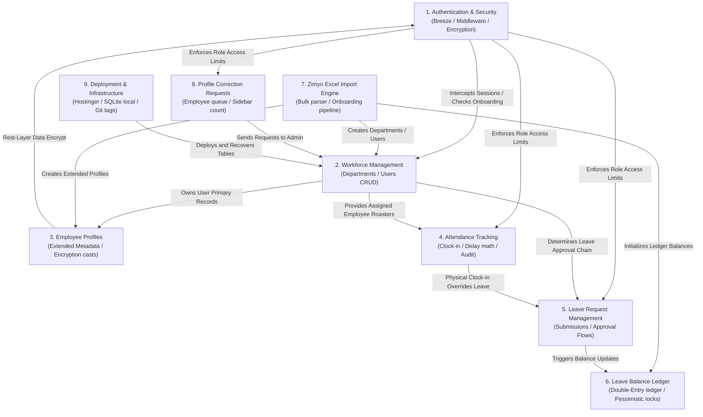

# AMS-V1 — System Architecture Map

This document describes the high-level subsystem relationships, data flow boundaries, and operational dependencies of the Attendance Management System Version 1 (AMS-V1).

---

## 1. Subsystem Interaction Model

The diagram below shows how the 9 major subsystems interact with each other and route their respective data dependencies:

---

## 2. Subsystem Relationships & Data Flows

### Authentication & Security Relationships
* **Authentication → Workforce Management & Dashboards:** 
  * The `CheckPasswordChange` middleware intercepts all incoming requests to workforce and dashboard routes.
  * If the authenticated user has `must_change_password = true`, they are blocked and redirected to the password change view.
* **Authentication → Role-Based Access Control (RBAC):**
  * Controllers map user roles (`admin`, `manager`, `employee`) to restrict query boundaries.
  * Route middleware (`EnsureUserIsAdmin`) restricts import routes, correction queues, and audit dashboards to admin staff.

---

### Department & Workforce Management Relationships
* **Workforce Management → Employee Profiles:**
  * When a new User is created under the workforce management controllers, a corresponding 1:1 mapped `employee_profiles` record is automatically initialized by the service layer.
* **Workforce Management → Attendance:**
  * Daily check-in lists and late audits use the department filters (`department_id`) and name search inputs from users to display roster attendance.
* **Workforce Management → Leave Management:**
  * When a standard employee applies for a leave request, the system checks their `manager_id` reporting chain to route approval actions to their direct supervisor.

---

### Employee Profiles Relationships
* **Employee Profiles → Authentication & Security:**
  * Sensitive data attributes mapped in [EmployeeProfile](file:///c:/Users/Lenovo/AMS-V1/app/Models/EmployeeProfile.php) use the Laravel encrypter configuration from the core config keys, ensuring decryption fails if the `APP_KEY` environment value changes.
* **Employee Profiles → Zimyo Import Engine:**
  * The Zimyo import parser directly instantiates and populates [EmployeeProfile](file:///c:/Users/Lenovo/AMS-V1/app/Models/EmployeeProfile.php) rows during Pass 1, writing personal and bank data.
* **Employee Profiles → Profile Correction Requests:**
  * When an employee submits a correction request, it points to a specific field in their [EmployeeProfile](file:///c:/Users/Lenovo/AMS-V1/app/Models/EmployeeProfile.php) table (e.g. `bank_name` or `pan`). When resolved by an Admin, the profile record is updated directly.

---

### Attendance Tracking & Auditing Relationships
* **Attendance Tracking → Authentication & Security:**
  * Endpoint authentication is enforced globally by standard `auth` middleware. Role limits are enforced inside the controllers (e.g. `EnsureUserIsAdmin` restricts access to the global audit logs dashboard `/admin/attendance-logs`).
* **Attendance Tracking → Leave Request Management (Rule B Overrides):**
  * When executing dashboard status filters, the `AttendanceService` queries [LeaveRequest](file:///c:/Users/Lenovo/AMS-V1/app/Models/LeaveRequest.php) to determine if an employee has an approved leave or WFH request. If no check-in exists, the status automatically shows as `on_leave` or `wfh` rather than `absent`.
  * If the employee physically clocks in (creating an active check-in row), the physical check-in overrides the approved leave, setting the day's status to `present` or `late`.

---

### Leave Request Management Relationships
* **Leave Management → Leave Balance Ledger:**
  * When a Manager/Admin reviews a leave request and clicks **Approve as Paid**, the transaction logic deducts the request's `total_days` from the user's `leave_balance` and logs a matching `deduction` ledger entry.
  * If a user cancels an approved paid leave, the cancellation controller refunds the amount back to `leave_balance` and records a `refund` ledger entry. Approvals as **Unpaid Leave** bypass balance changes.
* **Leave Management → Workforce Management:**
  * Managers can only see and approve leave requests for employees who are assigned directly to them via the `manager_id` foreign key.

---

### Leave Balance Ledger Relationships
* **Leave Balance Ledger → Authentication & Security (Concurrency Safeguards):**
  * Approving requests runs inside database transactions with pessimistic locks (`lockForUpdate()`), holding user records until updates are committed. This blocks concurrent login sessions from performing duplicate balance alterations.
* **Leave Balance Ledger → Zimyo Import Engine:**
  * When bulk importing new employees, the import pipeline directly calls [LeaveBalanceService](file:///c:/Users/Lenovo/AMS-V1/app/Services/LeaveBalanceService.php) to initialize their opening balance ledger line.
* **Leave Balance Ledger → Operations & Cron Schedule:**
  * The monthly accrual task is run as an automated cron command. The command checks for matching ledger logs in the current calendar month to guarantee idempotency.

---

### Zimyo Excel Import Engine Relationships
* **Zimyo Import Engine → Workforce Management & Profiles:**
  * Bulk sheet parsing creates new User rows and `employee_profiles` rows under a shared database transaction block. Missing departments are identified and created on the fly.
* **Zimyo Import Engine → Authentication & Security:**
  * Newly created users are assigned a hashed version of the system default password (`DEFAULT_EMPLOYEE_PASSWORD`) and flagged with `must_change_password = true`, forcing them into the security update workflow on first login.
* **Zimyo Import Engine → Leave Balance Ledger:**
  * Every created employee has their initial 2.00 leave credit initialized by a direct invocation of the ledger initialization services, recording an `opening_balance` entry.

---

### Profile Correction Requests Relationships
* **Profile Corrections → Workforce Management (HR Admin Resolution):**
  * Correction requests do not edit profiles directly. Instead, when an Admin resolves a request, the Admin copies the validated values to the target [EmployeeProfile](file:///c:/Users/Lenovo/AMS-V1/app/Models/EmployeeProfile.php) or [User](file:///c:/Users/Lenovo/AMS-V1/app/Models/User.php) record and marks the request as resolved.
* **Profile Corrections → User Interface (Badge Alert Counters):**
  * The left sidebar layout file query matches the count of pending correction requests and displays a red badge count alert for logged-in HR Administrators, providing live feedback.

---

### Deployment & Infrastructure Operations Relationships
* **Deployment & Operations → All Subsystems (Database Migrations):**
  * Deployed migrations structure the schema tables, constraints, foreign keys, and indexes for all subsystems (Authentication, Profiles, Attendance, Ledger, Corrections, and Imports).
* **Deployment & Operations → Authentication & Security:**
  * Setting correct `.env` files mapping (e.g. `APP_ENV=production`, `APP_DEBUG=false`, and setting secure `APP_KEY` secrets) locks database encryption casts in the Profiles domain.
