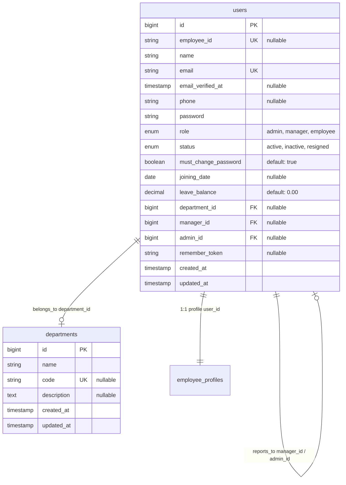

# AMS-V1 — Database Schema & Model Maps

This document records the database schema, model attributes, relations, index structures, and sensitive column designations for AMS-V1.

---

## 1. Schema Diagram

---

## 2. Table Definitions

### Table: `employee_profiles`
Stores extended personal, emergency, address, education, experience, and banking details.

* **Columns:**
  * `id` (`bigint unsigned`, Primary Key, Auto Increment): Unique identifier.
  * `user_id` (`bigint unsigned`, Unique, Foreign Key -> `users.id`): 1:1 user mapping.
  * Personal info: `father_name`, `mother_name` (`varchar(255)`), `gender` (`varchar(255)`), `date_of_birth` (`date`), `marital_status` (`varchar(100)`), `date_of_marriage` (`date`), `nationality`, `blood_group` (`varchar(255)`), `personal_email` (`varchar(255)`), `mobile_no` (`varchar(255)`).
  * Professional parameters: `pf_uan`, `passport_no` (`varchar(255)`), `aadhar_card` (`text`, casted: `encrypted`), `pan` (`text`, casted: `encrypted`), `pf_no`, `esi_number` (`varchar(255)`), `date_of_gratuity` (`date`), `payroll_type` (`varchar(255)`), `contract_end_date` (`date`), `office_landline`, `leave_rule`, `shift`, `designation`, `grade`, `employee_type`, `company`, `location`, `biometric_id`, `hiring_source`, `source_of_verification` (`varchar(255)`).
  * Address fields: `current_address1`, `current_address2`, `current_country`, `current_state`, `current_city`, `current_zip` (`varchar(255)`), `same_as_current_address` (`tinyint(1)`), `permanent_address1`, `permanent_address2`, `permanent_country`, `permanent_state`, `permanent_city`, `permanent_zip` (`varchar(255)`).
  * Banking information: `payment_type`, `bank_name`, `account_holder_name` (`varchar(255)`), `account_no` (`text`, casted: `encrypted`), `ifsc_code` (`text`, casted: `encrypted`).
  * Emergency contacts: `emergency_name`, `emergency_relationship`, `emergency_address`, `emergency_email`, `emergency_mobile` (`varchar(255)`).
  * Education: `degree_name`, `institution_name`, `passing_year`, `percentage` (`varchar(255)`).
  * Experience: `previous_company_name`, `previous_job_title` (`varchar(255)`), `previous_from_date`, `previous_to_date` (`date`), `state_name`, `probation_period` (`varchar(255)`), `probation_confirm_date`, `separation_date`, `last_working_day` (`date`), `previous_year_experience`, `years_completed`, `overall_year_experience` (`varchar(255)` - refactored from float).
  * `notice_days` (`int`, Nullable), `joining_date` (`date`, Nullable).
  * `created_at` / `updated_at` (`timestamp`): Database timestamps.

* **Indexes & Keys:**
  * `PRIMARY KEY (id)`
  * `UNIQUE KEY employee_profiles_user_id_unique (user_id)`
  * `FOREIGN KEY employee_profiles_user_id_foreign (user_id) REFERENCES users(id) ON DELETE CASCADE`

### Table: `departments`
Groups employees into business units to structure queries and gate access.

* **Columns:**
  * `id` (`bigint unsigned`, Primary Key, Auto Increment): Unique identifier.
  * `name` (`varchar(255)`): Friendly department name (e.g. `Engineering`).
  * `code` (`varchar(10)`, Unique, Nullable): Short identifier code (e.g. `ENG`).
  * `description` (`text`, Nullable): Business scope notes.
  * `created_at` / `updated_at` (`timestamp`): Database timestamps.

* **Indexes & Keys:**
  * `PRIMARY KEY (id)`
  * `UNIQUE KEY departments_code_unique (code)`

### Table: `users`
Tracks employee login credentials, role assignments, system statuses, and reporting hierarchies.

* **Columns:**
  * `id` (`bigint unsigned`, Primary Key, Auto Increment): Unique identifier.
  * `employee_id` (`varchar(255)`, Unique, Nullable): Standardized employee code (e.g. `EMP00010`).
  * `name` (`varchar(255)`): Employee full name.
  * `email` (`varchar(255)`, Unique): Official corporate email address.
  * `email_verified_at` (`timestamp`, Nullable): Verification timestamp.
  * `phone` (`varchar(255)`, Nullable): Mobile contact number.
  * `password` (`varchar(255)`): BCRYPT-hashed credentials.
  * `role` (`enum('admin', 'manager', 'employee')`, Default: `'employee'`): Functional permission group.
  * `status` (`enum('active', 'inactive', 'resigned')`, Default: `'active'`): Employee lifecycle state.
  * `must_change_password` (`tinyint(1)`, Default: `1`): Flag forcing user to reset password upon login.
  * `joining_date` (`date`, Nullable): Employment start date.
  * `leave_balance` (`decimal(8,2)`, Default: `0.00`): Accrued leave days available.
  * `department_id` (`bigint unsigned`, Nullable, Foreign Key -> `departments.id`): Business unit reference.
  * `manager_id` (`bigint unsigned`, Nullable, Foreign Key -> `users.id`): Reporting manager.
  * `admin_id` (`bigint unsigned`, Nullable, Foreign Key -> `users.id`): HR Administrator reference.
  * `remember_token` (`varchar(100)`, Nullable): Session token.
  * `created_at` / `updated_at` (`timestamp`): Database timestamps.

* **Indexes & Keys:**
  * `PRIMARY KEY (id)`
  * `UNIQUE KEY users_email_unique (email)`
  * `UNIQUE KEY users_employee_id_unique (employee_id)`
  * `FOREIGN KEY users_department_id_foreign (department_id) REFERENCES departments(id) ON DELETE SET NULL`
  * `FOREIGN KEY users_manager_id_foreign (manager_id) REFERENCES users(id) ON DELETE SET NULL`
  * `FOREIGN KEY users_admin_id_foreign (admin_id) REFERENCES users(id) ON DELETE SET NULL`

---

## 3. Sensitive & Encrypted Fields
No sensitive columns are stored directly in the `users` table. Instead, financial and identification keys are isolated in the 1:1 mapped `employee_profiles` table and casted as `encrypted` in Eloquent:

* `employee_profiles.aadhar_card` (Aadhaar number)
* `employee_profiles.pan` (PAN card ID)
* `employee_profiles.account_no` (Bank account number)
* `employee_profiles.ifsc_code` (Bank IFSC routing code)

These fields are encrypted using Laravel's standard AES-256-CBC encryption cipher, using the application-wide `APP_KEY`. They are automatically decrypted when accessed via model properties and encrypted when saved to the database.

---

## 4. Other Subsystem Tables
*(Detailed in respective domain commits)*
