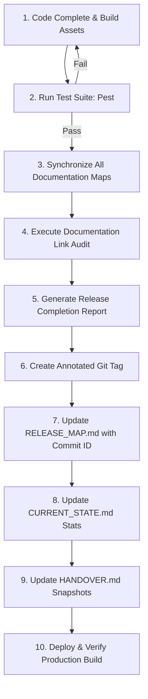

# AMS-V1 — Repository Governance and Git Standards

This document serves as the authoritative source of truth for commit quality, release tagging standards, historical traceability requirements, repository organization, and documentation synchronization rules across the Attendance Management System Version 1 (AMS-V1). Adherence to these standards is mandatory for all future development.

---

## 1. Philosophy & Objectives

In the lifecycle of AMS-V1, **Git history is treated as a first-class project asset**, equal in value to production code. Every change to the repository must be self-explanatory, transparent, and auditable. 

### Core Tenets:
* **No Reverse Engineering:** A developer or AI assistant reviewing the history years from now must be able to understand *why* a change was made and *how* it was structured without guessing.
* **Unified Narrative:** Commits, tags, release reports, Architectural Decision Records (ADRs), and documentation files must tell the same synchronized story.
* **Preservation of Institutional Memory:** Repository records are designed to simplify handovers, support audits, and serve as training baselines for downstream LLMs and developer onboarding.

---

## 2. Commit Standards

### A. Naming Conventions (Conventional Commits)
All commit messages must follow the Conventional Commits format:
`<type>(<scope>): <present-tense description>`

* **`feat`**: New user-facing feature additions.
* **`fix`**: Bug fixes affecting runtime behavior or storage.
* **`refactor`**: Code changes that improve architecture without modifying features.
* **`style`**: Contrast, typography, layout styling, or spacing pass changes.
* **`test`**: Writing or updating test suites.
* **`docs`**: Updates to markdown documentation maps or comments.
* **`chore`**: Maintenance, build configs, dependencies, or pipeline scripts.

*The scope must name the subsystem impacted (e.g., `leave`, `attendance`, `import`, `theme`).*

### B. Commit Body Requirements
Every meaningful commit must contain a detailed body answering:
1. **What changed?** (A concise list of structural updates)
2. **Why did it change?** (The business rationale or bug trigger)
3. **Which subsystem changed?** (The code layers affected)
4. **What business requirement was addressed?** (e.g. Phase objective)
5. **Which documentation was updated?** (e.g. `FEATURE_MAP.md`, `DECISION_LOG.md`)
6. **Which tests were affected?** (List of new or modified test cases)

### C. Granularity & Scope Guards
* **One Topic per Commit:** Do not bundle refactoring, bug fixes, and formatting adjustments into a single commit.
* **Granular Commits:** Keep commits focused on specific modules. Large, multi-module commits are rejected.

### D. Commit Examples

#### ❌ Unacceptable Commit:
```text
style: fix layout issues and update contrast

fixed the styling in leaves and attendance, changed table padding, and updated docs
```
*Why this fails:* Too generic, lacks subsystem scope, doesn't detail what variables changed, doesn't index updated docs, and fails to state why the change was necessary.

####  Acceptable Commit:
```text
style(theme): adjust contrast tokens and table layout spacing for Phase 4.7.3

What:
- Added desaturated light contrast color tokens to app.css and tailwind.config.js.
- Increased table cell vertical padding from py-3 to py-4 across all tables.
- Adjusted status tags (present, absent, late, leave) to use muted light text colors.

Why:
- Resolves WCAG AA contrast failures where dark text on dark backdrops had ratios under 1.6:1.
- Restores editorial visual aesthetics without resorting to bright pastel colors.

Subsystems: Theme, Layout views.
Docs Updated: CURRENT_STATE.md, FEATURE_MAP.md, RELEASE_MAP.md.
Tests Affected: Executed Pest test suite to verify zero markup regressions.
```

---

## 3. Documentation Synchronization Rules

Implementation changes and documentation must evolve together in the same commits. Deferring documentation is prohibited.

| Event Type | Mandatory Documentation Updates Required | Affected Files |
| :--- | :--- | :--- |
| **Feature Additions** | Update subsystem purpose, layout components, and codebase file indexes. | [FEATURE_MAP.md](file:///c:/Users/Lenovo/AMS-V1/docs/FEATURE_MAP.md), [PROJECT_INDEX.md](file:///c:/Users/Lenovo/AMS-V1/docs/PROJECT_INDEX.md) |
| **Feature Removals** | Remove indexes and update capabilities matrices. | [FEATURE_MAP.md](file:///c:/Users/Lenovo/AMS-V1/docs/FEATURE_MAP.md), [PROJECT_INDEX.md](file:///c:/Users/Lenovo/AMS-V1/docs/PROJECT_INDEX.md) |
| **Architecture Changes** | Log the decision, trace alternatives considered, and update interaction diagrams. | [DECISION_LOG.md](file:///c:/Users/Lenovo/AMS-V1/docs/DECISION_LOG.md) (New ADR), [ARCHITECTURE_MAP.md](file:///c:/Users/Lenovo/AMS-V1/docs/ARCHITECTURE_MAP.md) |
| **Database Changes** | Add schema details, column types, keys, and relational constraints. | [DATABASE_MAP.md](file:///c:/Users/Lenovo/AMS-V1/docs/DATABASE_MAP.md), [AMS_CHRONICLE.md](file:///c:/Users/Lenovo/AMS-V1/docs/AMS_CHRONICLE.md) |
| **Test Additions** | Document new verification scopes and test class details. | [TEST_MAP.md](file:///c:/Users/Lenovo/AMS-V1/docs/TEST_MAP.md) |
| **Deployment Changes** | Log new setup configurations, runtime settings, or clear cache steps. | [DEPLOYMENT.md](file:///c:/Users/Lenovo/AMS-V1/docs/DEPLOYMENT.md) |
| **Release Completions** | Append timeline logs, update version references, and handoff snapshot summaries. | [RELEASE_MAP.md](file:///c:/Users/Lenovo/AMS-V1/docs/RELEASE_MAP.md), [CURRENT_STATE.md](file:///c:/Users/Lenovo/AMS-V1/docs/CURRENT_STATE.md), [HANDOVER.md](file:///c:/Users/Lenovo/AMS-V1/docs/HANDOVER.md) |

---

## 4. Release Tag Standards

Release tags are permanent historical checkpoints. **Lightweight git tags are strictly prohibited.** All release milestones must use annotated tags (`git tag -a`) containing a detailed release notes structure in the message block.

### Mandatory Tag Annotation Structure:
```text
Release: v[Major].[Minor]-phase-[PhaseNum]

Phase: [Phase Name]

Objectives:
* [Core Goal 1]
* [Core Goal 2]

Business Changes:
* [Added/Modified/Removed user capabilities]

Technical Changes:
* [Architecture / Framework updates]

Database Changes:
* [Migrations executed]

Tests:
* [Pest status, count details, and assertions metrics]

Documentation Updates:
* [Markdown files modified]

ADR References:
* [ADR IDs logged in DECISION_LOG.md]

Risks / Future Dependencies:
* [Identified edge cases or next phase handoffs]
```

---

## 5. Release Completion Workflow

Before tagging any release on the `main` branch, the developer/AI must complete the following sequence:



---

## 6. Historical Traceability Model

Traceability is maintained through a clear mapping chain. Every business requirement must map down to its physical implementation and verification structures.

```
[Business Requirement]
       │
       ▼
[Architectural Domain / Subsystem]
       │
       ▼
[Codebase Files & Models]
       │
       ▼
[Database Tables & Migrations]
       │
       ▼
[Automated pest Test Cases]
       │
       ▼
[Decision Log ADR Reference]
       │
       ▼
[Production Release Version]
       │
       ▼
[Annotated Git Tag Checkpoint]
```

---

## 7. Repository Audit Checklist

Use this repeatable audit checklist before certifying the completion of any phase:
* **ADR Compliance:** Does the change introduce architectural abstractions or model additions? If yes, is there a matching entry in [DECISION_LOG.md](file:///c:/Users/Lenovo/AMS-V1/docs/DECISION_LOG.md)?
* **Relational Schema Sync:** Do database table changes match the tables detailed in [DATABASE_MAP.md](file:///c:/Users/Lenovo/AMS-V1/docs/DATABASE_MAP.md)?
* **Broken Link Scans:** Verify that all markdown links using the `file:///` scheme are valid and resolve correctly in the workspace.
* **Test Coverage Verification:** Are new features covered by corresponding Pest test cases? Run `vendor/bin/pest` to verify 100% green status.
* **Accrued Commits Mapping:** Check that the completion commit hash is recorded in [RELEASE_MAP.md](file:///c:/Users/Lenovo/AMS-V1/docs/RELEASE_MAP.md) and version references are updated in [CURRENT_STATE.md](file:///c:/Users/Lenovo/AMS-V1/docs/CURRENT_STATE.md).

---

## 8. AI Continuation Rules

Future AI development subagents or new sessions must adhere to these instructions:
1. **Mandatory Documentation Reading:** Before changing any source code, read `docs/GIT_STANDARDS.md`, `docs/CURRENT_STATE.md`, and the target module index in `docs/PROJECT_INDEX.md`.
2. **Concurrent Updates:** Modify related documentation files within the *same* tool execution chunks as the code modifications.
3. **Verify Before Declaring Complete:** Propose compilation builds (`npm run build`) and run Pest test suites to verify system integrity before requesting final user sign-off.
4. **Historical Handovers:** Provide a comprehensive Release Completion Report at the end of the phase to support immediate handover.

---

## 9. Quality Gates

No release is considered complete, ready for production, or approved unless:
1. **Test Gate:** 100% of Pest tests pass successfully without warning outputs.
2. **Docs Gate:** Every documentation map has been audited and synchronized.
3. **Traceability Gate:** The release commit is tagged, logged, and references the matching ADRs.
4. **Handover Gate:** [HANDOVER.md](file:///c:/Users/Lenovo/AMS-V1/docs/HANDOVER.md) contains updated AI continuation prompts pointing directly to the new phase.
