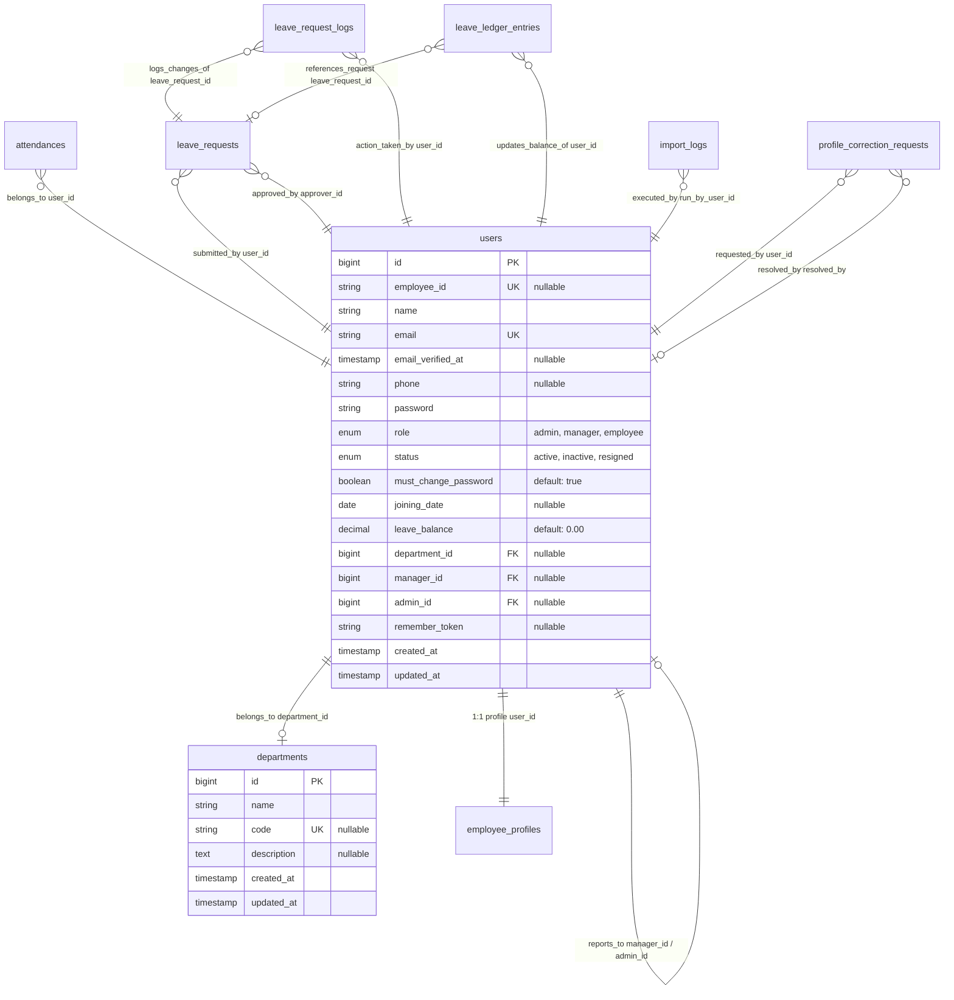

# AMS-V1 — Technical & Subsystem Traceability Map

This document serves as the unified technical directory, database schema map, codebase index, and verification suite mapping for the Attendance Management System Version 1 (AMS-V1). It groups all developer information by subsystem module to keep files, routes, tables, and test coverage fully traceable.

---

## 1. Subsystem Architecture Map

---

## 2. Core Business Subsystems

---

### Module 1: Authentication, Onboarding & RBAC

#### A. Business Purpose & Architecture Lineage
* **Purpose:** Secures personnel files and restricted actions by regulating session authentication, enforcing strong password conventions, forcing onboarding updates for temporary passwords, and partitioning permissions across roles (`admin`, `manager`, `employee`).
* **Lineage:** 
  * *Phase B:* Standard Laravel Breeze layouts setup.
  * *Phase C.1:* Added basic user role columns.
  * *Phase D:* Added reporting parent keys (`manager_id`, `admin_id`) and `must_change_password` column.
  * *Phase E:* Created `CheckPasswordChange` interceptor middleware.
  * *Current State:* Public self-registration is disabled. Admins reset passwords to default, which re-arms forced onboard redirections.

#### B. Codebase Mappings
* **Controllers:**
  * [AuthenticatedSessionController.php](file:///c:/Users/Lenovo/AMS-V1/app/Http/Controllers/Auth/AuthenticatedSessionController.php) (login / logout)
  * [PasswordController.php](file:///c:/Users/Lenovo/AMS-V1/app/Http/Controllers/Auth/PasswordController.php) (force-reset onboarding password save)
  * [PasswordResetLinkController.php](file:///c:/Users/Lenovo/AMS-V1/app/Http/Controllers/Auth/PasswordResetLinkController.php) (forgot-password link creation)
  * [NewPasswordController.php](file:///c:/Users/Lenovo/AMS-V1/app/Http/Controllers/Auth/NewPasswordController.php) (recovery link verification)
* **Middleware & Policies:**
  * [CheckPasswordChange.php](file:///c:/Users/Lenovo/AMS-V1/app/Http/Middleware/CheckPasswordChange.php) (forces updates)
  * [EnsureUserIsAdmin.php](file:///c:/Users/Lenovo/AMS-V1/app/Http/Middleware/EnsureUserIsAdmin.php) (restricts route access)
* **Routes:**
  * `login` / `logout` (declared in [auth.php](file:///c:/Users/Lenovo/AMS-V1/routes/auth.php))
  * `password.change` / `password.change.update` (onboarding redirects)
  * `admin.employees.reset-password` (forces reset)
* **Views:**
  * `resources/views/auth/login.blade.php`
  * `resources/views/auth/change-password.blade.php`

#### C. Database Schema
* **Table:** `users` (Tracks login credentials, role assignments, and onboarding indicators)
  * `id` (`bigint unsigned`, PK): Unique row identifier.
  * `name` (`varchar(255)`): Full employee name.
  * `email` (`varchar(255)`, UK): Unique email address.
  * `password` (`varchar(255)`): BCRYPT-hashed credentials.
  * `role` (`enum('admin','manager','employee')`, Default: `'employee'`): Permissions group.
  * `must_change_password` (`tinyint(1)`, Default: `1`): Onboarding force flag.

#### D. Verification Suite
* **Test File:** [PasswordStrategySecurityTest.php](file:///c:/Users/Lenovo/AMS-V1/tests/Feature/PasswordStrategySecurityTest.php)
  * *Scenarios:*
    1. Creation fails if default provisioning credentials are unset in `.env`.
    2. Admin can reset any employee password to default.
    3. Resetting password re-arms onboarding change-password intercepts.
* **Test File:** [AuthenticationTest.php](file:///c:/Users/Lenovo/AMS-V1/tests/Feature/Auth/AuthenticationTest.php)
  * *Scenarios:*
    1. Users can authenticate with valid credentials.
    2. Invalid passwords fail authentication.

---

### Module 2: Department & Workforce Directory

#### A. Business Purpose & Architecture Lineage
* **Purpose:** Partitions the company into business units, governs primary employee details, maps reporting structures, and enforces RBAC boundaries so managers only access subordinates.
* **Lineage:**
  * *Phase C.1:* Department and Employee CRUD list directories.
  * *Phase D:* Self-referencing manager hierarchies. Manager indexes restricted to direct reports.
  * *Phase 4.7.3:* Standardized table vertical cell padding (`py-3.5 px-5`), aligned monospaced ID headers, and added hover row indicators.

#### B. Codebase Mappings
* **Controllers:**
  * [DepartmentController.php](file:///c:/Users/Lenovo/AMS-V1/app/Http/Controllers/DepartmentController.php) (CRUD for departments)
  * [EmployeeController.php](file:///c:/Users/Lenovo/AMS-V1/app/Http/Controllers/EmployeeController.php) (Workforce CRUD, password resets, profile tabs saves)
* **Models:**
  * [Department.php](file:///c:/Users/Lenovo/AMS-V1/app/Models/Department.php)
  * [User.php](file:///c:/Users/Lenovo/AMS-V1/app/Models/User.php) (references department and manager relationships)
* **Services:**
  * [EmployeeService.php](file:///c:/Users/Lenovo/AMS-V1/app/Services/EmployeeService.php) (coordinates employee saves)
* **Views:**
  * `resources/views/departments/index.blade.php`, `create.blade.php`, `edit.blade.php`
  * `resources/views/employees/index.blade.php`, `create.blade.php`, `edit.blade.php`, `show.blade.php`

#### C. Database Schema
* **Table:** `departments` (Groups staff into active operational divisions)
  * `id` (`bigint unsigned`, PK): Unique row identifier.
  * `name` (`varchar(255)`): Department name.
  * `code` (`varchar(10)`, UK, Nullable): Short code (e.g. `ENG`).
  * `description` (`text`, Nullable): Description block.
* **Table Columns (`users`):**
  * `employee_id` (`varchar(255)`, UK, Nullable): Standardized code (e.g. `EMP00010`).
  * `status` (`enum('active','inactive','resigned')`, Default: `'active'`).
  * `department_id` (`bigint unsigned`, FK -> `departments.id`, Nullable, ON DELETE SET NULL).
  * `manager_id` (`bigint unsigned`, FK -> `users.id`, Nullable, ON DELETE SET NULL).

#### D. Verification Suite
* **Test File:** [HierarchySplitTest.php](file:///c:/Users/Lenovo/AMS-V1/tests/Feature/HierarchySplitTest.php)
  * *Scenarios:*
    1. Users can only view employees in their own department (if scoped).
    2. Admin can create other Admins; Managers cannot create Admins or Managers.
    3. Employees cannot report to themselves, and Admins cannot report to Managers.
    4. Managers can only view details of direct reports.

---

### Module 3: Employee Profiles & Encrypted Fields

#### A. Business Purpose & Architecture Lineage
* **Purpose:** Stores comprehensive employee metadata (education, addresses, emergency contacts, tenure, previous jobs) while encrypting identification and banking values to ensure data privacy.
* **Lineage:**
  * *Phase 4:* Isolated profile data in a 1:1 mapping table `employee_profiles` and casted sensitive values using AES-256 model casts.
  * *Phase 4.3:* Changed experience columns from decimals to nullable strings to prevent uploader crashes when importing text durations (e.g., `"5 Years 2 Months"`).
  * *Phase 4.7.3:* Re-skinned light-mode Breeze cards to dark-theme `.panel` containers in settings pages.

#### B. Codebase Mappings
* **Models:**
  * [EmployeeProfile.php](file:///c:/Users/Lenovo/AMS-V1/app/Models/EmployeeProfile.php) (implements database encryption casts)
* **Controllers:**
  * [ProfileController.php](file:///c:/Users/Lenovo/AMS-V1/app/Http/Controllers/ProfileController.php) (basic credentials updates)
* **Views:**
  * `resources/views/profile/edit.blade.php`
  * `resources/views/profile/partials/update-profile-information-form.blade.php`
  * `resources/views/profile/partials/update-password-form.blade.php`
  * `resources/views/profile/partials/delete-user-form.blade.php`

#### C. Database Schema
* **Table:** `employee_profiles` (1:1 mapping to parent User)
  * `id` (`bigint unsigned`, PK): Unique row identifier.
  * `user_id` (`bigint unsigned`, UK, FK -> `users.id`, ON DELETE CASCADE).
  * Encrypted details: `aadhar_card`, `pan`, `account_no`, `ifsc_code` (`text`, Nullable).
  * Experience details: `previous_year_experience`, `years_completed`, `overall_year_experience` (`varchar(255)`, Nullable).

#### D. Verification Suite
* **Test File:** [EmployeeProfileTest.php](file:///c:/Users/Lenovo/AMS-V1/tests/Feature/EmployeeProfileTest.php)
  * *Scenarios:*
    1. Bidirectional 1:1 Eloquent relations resolve user and profile attributes.
    2. Deleting a user cascade-purges its matching profiles record.
    3. Aadhaar, PAN, Account No, and IFSC Code are stored as encrypted ciphertext in database but decrypt dynamically on read.
* **Test File:** [EmployeeProfileAccessTest.php](file:///c:/Users/Lenovo/AMS-V1/tests/Feature/EmployeeProfileAccessTest.php)
  * *Scenarios:*
    1. Employees can read their own profiles, but viewing other profiles is blocked (403).
    2. Admins can read all profiles; Managers can only read direct reports' profiles.

---

### Module 4: Attendance Tracking & Auditing

#### A. Business Purpose & Architecture Lineage
* **Purpose:** Logs employee daily check-in and check-out timestamps, evaluates tardiness delays against shift times, excludes Sundays, integrates approved leaves, and provides HR with a search-filtered audit panel.
* **Lineage:**
  * *Phase C:* Basic check-in/out engine, using 09:00 AM shift start with 15-minute grace period.
  * *Phase E:* Rule B: approved leaves override empty attendance records, displaying as `on_leave` or `wfh`.
  * *Phase 4.4:* Built Punctuality Audit console.
  * *Phase 4.5:* Transited shift start time to 09:30 using a configuration threshold date (`new_rules_start_date`) to protect historical logs.
  * *Phase 4.7.3:* Remediated margins, vertical table padding, and desaturated present/absent/late tag colors.

#### B. Codebase Mappings
* **Controllers:**
  * [AttendanceController.php](file:///c:/Users/Lenovo/AMS-V1/app/Http/Controllers/AttendanceController.php) (clock check-in/out)
  * [ManagerAttendanceController.php](file:///c:/Users/Lenovo/AMS-V1/app/Http/Controllers/ManagerAttendanceController.php) (roster view list)
  * [AttendanceAuditController.php](file:///c:/Users/Lenovo/AMS-V1/app/Http/Controllers/AttendanceAuditController.php) (audit query console filters)
* **Models:**
  * [Attendance.php](file:///c:/Users/Lenovo/AMS-V1/app/Models/Attendance.php) (implements `late_minutes` delay math)
* **Services:**
  * [AttendanceService.php](file:///c:/Users/Lenovo/AMS-V1/app/Services/AttendanceService.php) (computes daily status, averages, and delays)
* **Views:**
  * `resources/views/attendance/employee-dashboard.blade.php`
  * `resources/views/admin/attendance-logs.blade.php` (Audit logs panel)

#### C. Database Schema
* **Table:** `attendances` (Logs daily workspace checks)
  * `id` (`bigint unsigned`, PK): Unique row identifier.
  * `user_id` (`bigint unsigned`, FK -> `users.id`, ON DELETE CASCADE).
  * `date` (`date`): Calendar date.
  * `check_in_time` / `check_out_time` (`timestamp`, Nullable).
  * `status` (`enum('present','absent','late','on_leave','wfh')`, Default: `'absent'`).
  * *Index Constraints:* UNIQUE KEY `attendances_user_id_date_unique (user_id, date)`.

#### D. Verification Suite
* **Test File:** [AttendanceVerificationTest.php](file:///c:/Users/Lenovo/AMS-V1/tests/Feature/AttendanceVerificationTest.php)
  * *Scenarios:*
    1. Employees can check in and check out, creating database timestamps.
    2. Concurrent check-ins on the same day are blocked by unique date checks.
* **Test File:** [AttendanceMetricsTest.php](file:///c:/Users/Lenovo/AMS-V1/tests/Feature/AttendanceMetricsTest.php)
  * *Scenarios:*
    1. Checks status as `present` if clock-in is on or before grace threshold.
    2. Checks status as `late` and calculates correct delay minutes if after grace.
* **Test File:** [AttendanceAuditTest.php](file:///c:/Users/Lenovo/AMS-V1/tests/Feature/AttendanceAuditTest.php)
  * *Scenarios:*
    1. HR can filter logs by date, status, department, and employee name.
    2. The audit center correctly calculates late delay averages.

---

### Module 5: Leave Request Management

#### A. Business Purpose & Architecture Lineage
* **Purpose:** Handles employee leave submissions across Planned, Unplanned, and Birthday Leave categories, routes approvals to supervisors, resolves attendance status outcomes for payroll mapping, and manages complimentary credit expiration rules.
* **Lineage:**
  * *Phase E:* Leave requests table, status transitions, and approvals.
  * *Phase 4.6:* Made `leave_type` nullable in submissions; general employees submit dates/reasons only. Managers select Paid/Unpaid classification on review.
  * *Phase 4.7.2:* Removed Paid/Unpaid workflows. Leaves categorized as Planned, Unplanned, or Birthday. Approved requests dynamically resolve attendance to `on_leave`. Integrated the reusable `leave_credits` engine for birthday credits.
  * *Phase 4.7.3:* Harmonized visual contrast, cleaned up pink button backgrounds, and aligned approval modal button contrasts.

#### B. Codebase Mappings
* **Controllers:**
  * [LeaveRequestController.php](file:///c:/Users/Lenovo/AMS-V1/app/Http/Controllers/LeaveRequestController.php) (submits, cancels, overrides, and saves approval decisions)
* **Models:**
  * [LeaveRequest.php](file:///c:/Users/Lenovo/AMS-V1/app/Models/LeaveRequest.php) (tracks date ranges, days counts, and links to credits)
  * [LeaveRequestLog.php](file:///c:/Users/Lenovo/AMS-V1/app/Models/LeaveRequestLog.php) (stores request actions audit trail)
  * [LeaveCredit.php](file:///c:/Users/Lenovo/AMS-V1/app/Models/LeaveCredit.php) (tracks special leave credit tokens)
* **Views:**
  * `resources/views/leaves/index.blade.php`, `create.blade.php`, `show.blade.php`

#### C. Database Schema
* **Table:** `leave_requests` (Tracks leave applications)
  * `id` (`bigint unsigned`, PK): Unique identifier.
  * `user_id` (`bigint unsigned`, FK -> `users.id`, ON DELETE CASCADE).
  * `leave_type` (`varchar(255)`, Nullable): Resolved leave type.
  * `leave_credit_id` (`bigint unsigned`, Nullable, FK -> `leave_credits.id`, ON DELETE SET NULL).
  * `status` (`varchar(255)`, Default: `'pending'`).
  * `approver_id` (`bigint unsigned`, Nullable, FK -> `users.id`, ON DELETE SET NULL).
* **Table:** `leave_request_logs` (Tracks request action details)
  * `id` (`bigint unsigned`, PK): Unique row identifier.
  * `leave_request_id` (`bigint unsigned`, FK -> `leave_requests.id`, ON DELETE CASCADE).
  * `from_status` / `to_status` (`varchar(255)`), `action` (`varchar(255)`).
* **Table:** `leave_credits` (Tracks allocated special leave credits)
  * `id` (`bigint unsigned`, PK): Unique identifier.
  * `user_id` (`bigint unsigned`, FK -> `users.id`, ON DELETE CASCADE).
  * `credit_type` (`varchar(255)`): Type of credit (e.g. `'birthday'`).
  * `amount` (`decimal(8,2)`, Default: `1.00`): Granted amount.
  * `used_amount` (`decimal(8,2)`, Default: `0.00`): Consumed amount.
  * `status` (`varchar(50)`, Default: `'active'`): Status flag (`active`, `expired`, `voided`).
  * `unlocked_at` (`date`): Validity start date.
  * `expires_at` (`date`): Expiry date.
  * `source_identifier` (`varchar(255)`): Unique token per employee cycle (e.g. `'birthday_2026'`).
  * `granted_by` (`bigint unsigned`, Nullable, FK -> `users.id`, ON DELETE SET NULL).
  * `notes` (`text`, Nullable): Remarks.
  * `source_metadata` (`json`, Nullable): Diagnostic fields.

#### D. Verification Suite
* **Test File:** [LeaveManagementTest.php](file:///c:/Users/Lenovo/AMS-V1/tests/Feature/LeaveManagementTest.php)
  * *Scenarios:*
    1. Employees submit leave requests and cancel pending/approved requests.
    2. Managers approve or reject assigned employees' leaves; circular approvals are blocked.
    3. Admin override path adjusts balances and updates request status.
* **Test File:** [LeaveAuthorizationModelTest.php](file:///c:/Users/Lenovo/AMS-V1/tests/Feature/LeaveAuthorizationModelTest.php)
  * *Scenarios:*
    1. Birthday credits unlock 1 day before birthday, auto-approve birthday leave, and expire after 12 months.
    2. Overriding and rejecting birthday leave restores credits and updates daily attendance to `absent`.
    3. Leap year birthdays (February 29) resolve to February 27 in non-leap years.

---

### Module 6: Leave Accrual & Balance Ledger

#### A. Business Purpose & Architecture Lineage
* **Purpose:** Governs employee leave balance accounts under a transaction audit ledger and utilizes database concurrency locks to serialize simultaneous reviews.
* **Lineage:**
  * *Phase 4.5:* Replaced direct modifications of `users.leave_balance` with a double-entry database transaction ledger and added pessimistic row locking (`lockForUpdate`).

#### B. Codebase Mappings
* **Models:**
  * [LeaveLedgerEntry.php](file:///c:/Users/Lenovo/AMS-V1/app/Models/LeaveLedgerEntry.php) (ledger transaction mapping)
* **Console Commands:**
  * [InitializeBalancesCommand.php](file:///c:/Users/Lenovo/AMS-V1/app/Console/Commands/InitializeBalancesCommand.php) (`leaves:initialize-balances`)
  * [AccrueLeavesCommand.php](file:///c:/Users/Lenovo/AMS-V1/app/Console/Commands/AccrueLeavesCommand.php) (`leaves:accrue` adds 2 credits monthly, idempotent)

#### C. Database Schema
* **Table:** `leave_ledger_entries` (Logs leave transaction history logs)
  * `id` (`bigint unsigned`, PK): Unique row identifier.
  * `user_id` (`bigint unsigned`, FK -> `users.id`, ON DELETE CASCADE).
  * `leave_request_id` (`bigint unsigned`, Nullable, FK -> `leave_requests.id`, ON DELETE CASCADE).
  * `amount` (`decimal(8,2)`): Credit (+ve) or debit (-ve) adjustment.
  * `type` (`varchar(255)`): Transaction type (`opening_balance`, `accrual`, `deduction`, `refund`, `adjustment`).
* **Table Columns (`users`):**
  * `leave_balance` (`decimal(8,2)`, Default: `0.00`).

#### D. Verification Suite
* **Test File:** [LeaveBalanceTest.php](file:///c:/Users/Lenovo/AMS-V1/tests/Feature/LeaveBalanceTest.php)
  * *Scenarios:*
    1. New employees have opening balances initialized to 2.00.
    2. Monthly accrual command credits 2.00 leaves to all active staff.
    3. Double execution of accrual command in the same calendar month is blocked (idempotent guard).
    4. Cancelling approved leaves refunds deducted days to `users.leave_balance`.
    5. Admin overrides adjust balances and write matching ledger rows.

---

### Module 7: Zimyo Excel Import Engine

#### A. Business Purpose & Architecture Lineage
* **Purpose:** Handles bulk employee directory migrations from Zimyo spreadsheet exports, auto-creates missing departments, maps manager hierarchies in two passes, and logs error warnings.
* **Lineage:**
  * *Phase 4.1:* Developed two-pass import to resolve manager-employee relationships.
  * *Phase 4:* Added JSON logs to `import_logs` table.
  * *Phase 4.7.3:* Harmonized layout metrics, error tables, and styled warning message boxes.

#### B. Codebase Mappings
* **Controllers:**
  * [ImportController.php](file:///c:/Users/Lenovo/AMS-V1/app/Http/Controllers/ImportController.php) (imports excel forms and outputs summary tables)
* **Models:**
  * [ImportLog.php](file:///c:/Users/Lenovo/AMS-V1/app/Models/ImportLog.php) (logs filename, stats, and skipped rows warnings)
* **Services:**
  * [EmployeeImportService.php](file:///c:/Users/Lenovo/AMS-V1/app/Services/EmployeeImportService.php) (Zimyo two-pass spreadsheet parser)
* **Views:**
  * `resources/views/admin/import-employees.blade.php`

#### C. Database Schema
* **Table:** `import_logs` (Records import metrics and failures details)
  * `id` (`bigint unsigned`, PK): Unique row identifier.
  * `filename` (`varchar(255)`): Filename.
  * `run_by_user_id` (`bigint unsigned`, Nullable, FK -> `users.id`, ON DELETE SET NULL).
  * `rows_processed` / `created_count` / `updated_count` / `error_count` (`int`).
  * `errors` (`json`, Nullable): skipped row validation failures index.

#### D. Verification Suite
* **Test File:** [ImportEmployeesTest.php](file:///c:/Users/Lenovo/AMS-V1/tests/Feature/ImportEmployeesTest.php)
  * *Scenarios:*
    1. Only Admins can access imports dashboard or post spreadsheet files.
    2. Imports verify user directory registers, profiles details, and opening balances.
    3. Subordinate-to-manager links are mapped correctly in Pass 2 regardless of excel row sequence.
    4. Warnings (e.g. missing columns, invalid status flags) skip the row and log JSON logs to the import history.

---

### Module 8: Profile Correction Requests

#### A. Business Purpose & Architecture Lineage
* **Purpose:** Allows employees to request corrections to their profile fields and provides HR Admins with an interactive queue to resolve anomalies.
* **Lineage:**
  * *Phase 4.2:* Correction request forms, admin resolve queue, and transactions.
  * *Phase 4.6:* Integrated sidebar red notification badge counter to alert Admins.
  * *Phase 4.7.3:* Aligned request table layout, vertical cell spacing, and desaturated tags.

#### B. Codebase Mappings
* **Controllers:**
  * [ProfileCorrectionRequestController.php](file:///c:/Users/Lenovo/AMS-V1/app/Http/Controllers/ProfileCorrectionRequestController.php) (handles store and resolve requests)
* **Models:**
  * [ProfileCorrectionRequest.php](file:///c:/Users/Lenovo/AMS-V1/app/Models/ProfileCorrectionRequest.php) (tracks pending/resolved request states)
* **Views:**
  * `resources/views/admin/correction-requests/index.blade.php` (HR review queue)
  * [sidebar.blade.php](file:///c:/Users/Lenovo/AMS-V1/resources/views/components/sidebar.blade.php) (notification badge element)

#### C. Database Schema
* **Table:** `profile_correction_requests` (Tracks edit request logs)
  * `id` (`bigint unsigned`, PK): Unique row identifier.
  * `user_id` (`bigint unsigned`, FK -> `users.id`, ON DELETE CASCADE).
  * `field` (`varchar(255)`): Column field target (e.g. `'personal_email'`).
  * `message` (`text`): Employee notes.
  * `status` (`varchar(255)`, Default: `'pending'`).
  * `admin_note` (`text`, Nullable).
  * `resolved_by` (`bigint unsigned`, Nullable, FK -> `users.id`, ON DELETE SET NULL).
  * `resolved_at` (`timestamp`, Nullable).

#### D. Verification Suite
* **Test File:** [ProfileCorrectionRequestTest.php](file:///c:/Users/Lenovo/AMS-V1/tests/Feature/ProfileCorrectionRequestTest.php)
  * *Scenarios:*
    1. Employees submit correction requests.
    2. Standard employees cannot submit a new request if a pending request already exists.
    3. Admins can view request queue; standard staff are blocked.
    4. Admin can resolve request, setting resolution details and updating state to `resolved`.
